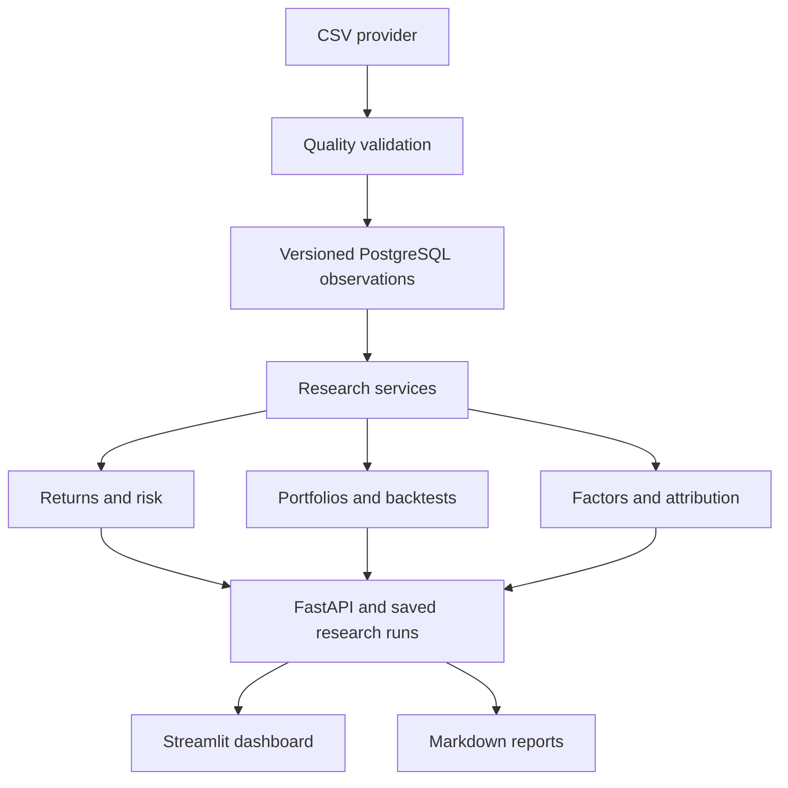

# MarketPulse
### Quantitative Investment Research & Risk Analytics Platform

[**🚀 Live Demo**](https://marketpulse-prem.streamlit.app/) · [**GitHub Repository**](https://github.com/Prem7105/MarketPulse)


MarketPulse turns validated daily prices into reproducible asset, portfolio and strategy research. Built for explaining **data → research → risk → portfolio → decision support**, including an investment research interview. It is an independent educational project, with no affiliation or endorsement by Russell Investments.

**Real provider data only in the application.** Configure `TWELVEDATA_API_KEY` in `.env`; see [real-data setup](docs/real_market_data.md). There is no synthetic fallback. API access/real-time entitlement needs your valid vendor key; it has not yet been verified.

## What works

- CSV provider abstraction, row-level quality reports, immutable dataset hashes, PostgreSQL persistence and Alembic migrations.
- Simple/log returns, compounded performance, daily/weekly/monthly/yearly returns and configurable annualization.
- Sharpe, Sortino, Calmar, historical VaR/ES, downside deviation, drawdown episodes, beta, alpha, tracking error, information ratio and capture ratios.
- Equal/custom weights, drifting holdings, daily/monthly/quarterly rebalancing, covariance and component risk.
- Six-factor architecture; single/multiple factor OLS with HAC standard errors, coefficients, intervals and diagnostics.
- Wealth-linked security attribution, active contribution and a tested single-period Brinson–Fachler function.
- Buy-and-hold, equal-weight, momentum, moving-average trend and volatility-target strategies, explicit execution delay, cash, entry costs and turnover.
- Ten Streamlit views, Plotly charts, FastAPI OpenAPI, transparent comparisons/rankings and saved Markdown research reports.
- Deterministic test fixtures, five research notebooks, mathematical derivations, interview guides and SQL exercises.

## Start with Docker

Install Docker with Compose. In the project folder:

```bash
cp .env.example .env
docker compose up --build
```

On Windows PowerShell use `Copy-Item .env.example .env` for the first line.

- Dashboard: http://localhost:8501
- API documentation: http://localhost:8000/docs
- Database-aware health check: http://localhost:8000/health

Compose starts PostgreSQL, runs migrations only, then starts the API and dashboard. Load actual prices using the dashboard connection panel. Ports bind to localhost. Demo credentials are for local use only. If changing the password, use a URL-safe password or URL-encode it in connection strings. `docker compose down` preserves data; `down -v` deletes it.

## Local Python development

Python 3.12+ and PostgreSQL are the intended stack. The lock files were resolved for Python 3.12; use that version for strict reproducibility.

```bash
python -m venv .venv
source .venv/bin/activate
# PowerShell: .venv\Scripts\Activate.ps1
pip install -r requirements-dev.lock
pip install --no-deps -e .
cp .env.example .env
# Start PostgreSQL or run: docker compose up -d db
alembic upgrade head
python -m scripts.ingest_market_data --symbols AAPL MSFT SPY
uvicorn app.main:app --host 127.0.0.1 --port 8000
```

In another activated terminal:

```bash
streamlit run dashboard/app.py --browser.gatherUsageStats=false
```

For an offline SQLite demonstration, set `DATABASE_URL=sqlite:///./marketpulse.db` in `.env` before migration. SQLite is a development fallback, not the production database. Run all commands from the repository root. Set the provider key in `.env` before importing; restart the API after changing environment settings.

## Main demonstration

1. Configure the API key, load real daily history, then select the resulting dataset, equities and SPY benchmark.
2. Inspect Data Quality before interpreting results.
3. Compare return/risk, then inspect rolling metrics and drawdown episodes.
4. In Portfolio Analytics, review weights and costs and click Analyze portfolio.
5. Inspect Attribution and component volatility; understand why covariance matters.
6. Estimate market/size/value/momentum exposures in Factor Analysis.
7. Compare strategy results after costs in Backtesting; record parameter choices before evaluating a holdout.
8. Generate and download a report in Research Reports.

A complete scripted version:

```bash
python -m scripts.run_research --output reports/sample_research.md
```

A report is generated only after actual data is imported. No pre-generated performance numbers are included.

## Import your own data

CSV columns: `date,symbol,open,high,low,close,adjusted_close`. Dates must be `YYYY-MM-DD`, prices finite and positive, OHLC consistent. Returns use provider-supplied adjusted_close. Do not mix currencies or price-only/total-return conventions without normalization.

```bash
python -m scripts.ingest_data your_prices.csv --source "Vendor name, export date and adjustment method" --benchmark SPY
```

Optional `--factors factors.csv --risk-free risk_free.csv`: factors have a date index and named decimal daily return columns; market factor must be an **excess** market return. Risk-free has `date,risk_free`, in daily decimals. Factor and risk-free dates must fully cover analyzed return dates. The API `/ingest` also accepts these CSVs as bounded text fields.

Invalid rows are rejected with reasons; valid but suspicious observations remain. All duplicate symbol/date rows are rejected. Weekday gap warnings cannot distinguish exchange holidays. Asset calendars must match exactly for portfolio and benchmark work; no implicit forward filling or pairwise date deletion.

## Architecture and database



`app/research` contains pure calculations; `app/services` handles datasets, orchestration and reporting; `app/api` validates HTTP requests. `plan.md` contains the detailed blueprint and ERD. `docs/database.md` describes all tables. Composite dataset/asset/date uniqueness prevents ambiguous observations. Research runs preserve parameters, source version, output and methodology.

## API workflow

`GET /datasets` → choose dataset ID → `POST /research/compare`:

```json
{"dataset_id":"<64-character hash from /datasets>","symbols":["AAPL","MSFT"],"benchmark":"SPY","periods":252,"annual_rf":0.03,"window":60}
```

Routes also include `/research/asset`, `/research/factor-analysis`, `/portfolios`, `/backtests`, `/reports`, `/research/runs`, and resource retrieval routes. Explore exact request schemas in `/docs`. The asset metrics/risk/drawdown GET aliases return the same complete asset analysis. Reports are plain-text Markdown. Optional `API_KEY` requires an `X-API-Key` header except on health/docs; the dashboard reads the same environment setting.

## Numerical conventions you should understand

- Annualization uses a configurable observation count; daily default is 252. Prices must represent consistently spaced trading sessions. Irregular calendars require preprocessing.
- Sharpe annualizes mean daily excess return over sample standard deviation. Sortino averages squared shortfalls over **all** periods. A zero denominator produces null, not infinity or a favorable rank.
- VaR/ES are signed one-period losses; negative values mean even the sampled tail was profitable. These are historical estimates, not stress guarantees.
- Drawdowns start from initial wealth one, so the first loss counts. Unrecovered episodes retain a null recovery.
- Fixed weights are initial allocations. Holdings drift until a scheduled rebalance. Covariance risk at target weights and realized path volatility answer different questions.
- Price-derived signals at close t execute at close t+1, earning the return ending t+2. This conservative close-only convention is explicit and tested.
- Turnover is the sum of absolute risky weight changes. Cost applies to traded risky exposure; net return is `(1-cost)*(1+gross)-1`. Cash earns configured risk-free return. No terminal liquidation is assumed.
- Factor regression uses contemporaneous excess returns and HAC errors. Alpha is an annualized arithmetic intercept, not CAGR. Regression is association, not causation.
- Brinson attribution is single-period; the dashboard's multi-period security attribution uses wealth linking, including cash and costs.

## Tests, migrations and quality

```bash
pytest --cov=app --cov-report=term-missing
ruff check .
black --check .
alembic check
```

PostgreSQL integration tests run when `TEST_DATABASE_URL` points to a **dedicated disposable database whose name contains `test`**. That test migrates down/up and must never point at research data. CI provisions PostgreSQL 16 and also validates Compose and builds the image. Review `docs/final_audit.md` for what was actually executed in the delivery environment.

Migrations: `alembic upgrade head`; one-step reversal: `alembic downgrade -1`. A downgrade destroys the tables/data created by the initial migration. Generate future migrations with `alembic revision --autogenerate -m "Describe change"`, inspect the SQL, then test against PostgreSQL.

## Documentation

- `plan.md`: implementation architecture, phases, acceptance and trade-offs.
- `docs/mathematics.md`: formula, example, implementation and edge cases.
- `docs/research_methodology.md`: interpretation, assumptions and limitations.
- `docs/interview_guide.md`: 50+ architecture/quant questions with answers.
- `docs/sql_research_questions.md`: 30 PostgreSQL exercises and executable patterns.
- `docs/python_research_questions.md`, `docs/finance_interview_guide.md`.
- `docs/2_minute_pitch.md`, `docs/5_minute_deep_dive.md`, `docs/whiteboard_explanation.md`.
- `notebooks/`: five coherent research walkthroughs using the same tested services.

Dashboard screenshot placeholder: capture your running Overview, Portfolio and Factor pages here after choosing the presentation dataset. No mock screenshot is presented as a running application.

## Limitations and next steps

This is a functioning research application, not a publicly hardened trading system. It has no account isolation, background jobs, multi-provider integration, exchange calendar, delisting-aware point-in-time universe, configured authentic factor feed, taxes, FX conversion, leverage, order book, market impact or settlement model. API authentication is a single optional key; public hosting needs TLS, user authorization, rate limits, request size enforcement and operational monitoring. Reports preserve results, but administrator-level database mutation is outside the append-only application guarantee.

Fixed universes create survivorship/selection bias. In-sample rankings and backtests encourage overfitting; no strategy here is claimed out-of-sample validated. HAC does not cure omitted variables or multiple testing. A short sample cannot estimate rare tail events reliably. Future priorities: licensed historical data and point-in-time universe, exchange calendars, authentic Fama–French factors, walk-forward evaluation, stress testing, richer execution costs, portfolio optimization and authenticated deployment.
