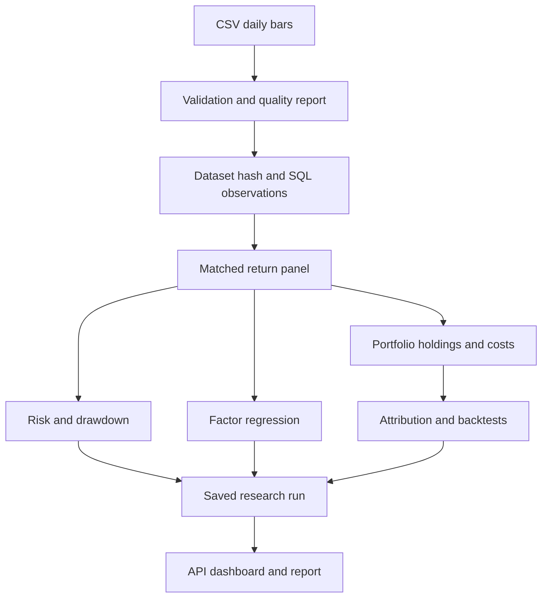

# Whiteboard explanation

Draw four connected regions: Input, Storage, Research and Presentation. Keep the arrows directional; save results back to versioned research runs.

Draw assets and datasets as separate entities pointing into asset_prices. Label the unique key `(dataset_id,asset_id,date)`. Draw research_runs referencing dataset, and portfolios connecting through portfolio_positions to assets. Explain that identity, observation and analysis are different entities.

Under risk, write `R=P/Pprev−1`, `W=product(1+R)`, `D=W/max(1,previous W)−1`. Use 100→110→99 to demonstrate compounding. Write `Sharpe=mean(R-rf)/std(R-rf)*sqrt(N)` and state the zero-volatility case.

Under portfolio, write `Rp=sum(w_i R_i)` and `variance=w'Σw`. Show that weights are beginning-period weights and drift after the return. Add cash and cost terms, then explain how linked contributions reconcile to net terminal wealth.

Under factors, write `Ri-rf=alpha+beta'F+epsilon`. Label betas as conditional associations, alpha as an intercept, and HAC as an uncertainty estimator. Say that regressions do not establish causality.

For strategy timing, use a three-column table rather than a crowded diagram:

| Close t | Close t+1 | Close t+2 |
|---|---|---|
| Observe prices; calculate signal | Execute the delayed signal | First return earned by those holdings ends here |

Ask the interviewer to choose a price shock after a cutoff, then explain the future-perturbation test. Finish by identifying what the model omits: point-in-time universe, market impact, exchange calendar and genuine out-of-sample evaluation.
