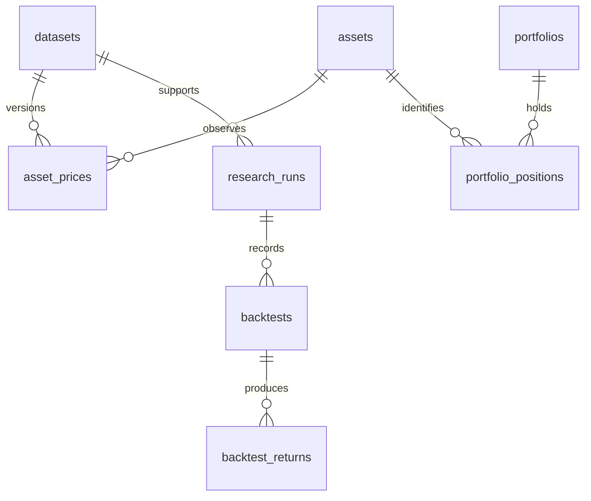

# Current revision: real provider data

The user superseded the synthetic demonstration requirement. Production defaults now use Twelve Data authenticated quotes and daily history; generated datasets/reports were removed. Test fixtures remain isolated. See docs/real_market_data.md for setup and limits. No API key has yet been supplied, so live access is pending. The blueprint below records the original implementation decisions; synthetic-data delivery items are superseded by this revision.

# MarketPulse — engineering and research blueprint

## Purpose and users
Build an explainable quantitative investment research workbench for students, analysts and portfolio researchers. The interview objective is to defend data lineage, numerical conventions and execution timing, not claim predictive power. Synthetic demonstration results are never historical evidence or investment advice.

## Requirements and architecture
CSV/provider → validation → immutable dataset version → PostgreSQL → Pandas return panel → pure NumPy/Pandas/SciPy research functions → portfolio/factor/backtest services → FastAPI → Streamlit → downloadable Markdown report. No unnecessary infrastructure. Python 3.12, SQLAlchemy 2, Alembic, Pydantic, statsmodels HAC regression, Plotly, pytest, Ruff and Black. Docker Compose runs PostgreSQL, migration/seed job, API and dashboard. SQLite is supported for isolated tests only.

Separate app/core (environment/logging), app/db (models/session), app/services (ingestion/orchestration/reporting), app/research (pure mathematics), app/api (validated HTTP boundary), dashboard, scripts, tests, notebooks, docs and data/sample. Streamlit calls the API; it never recalculates finance independently. Batch ingestion uses transactions. SQL filters data before Pandas constructs a panel.

## Schema and relationships
All price and factor observations belong to a dataset, so a later import cannot silently change an earlier run. Numeric price fields use Numeric(20,8), weights Numeric(18,10), dates SQL Date; JSON stores run parameters and serialized outputs. IDs are integer primary keys except content-addressed dataset IDs and UUID research run IDs.

| Table | Key and important columns | Relationships / constraints |
|---|---|---|
| datasets | id SHA256, source, created_at, row_count, start/end, quality | immutable input version |
| assets | id, symbol, name, currency | unique symbol |
| asset_prices | id, dataset_id, asset_id, date, OHLC, adjusted_close | unique dataset/asset/date; positive prices |
| benchmark_prices | id, dataset_id, asset_id, date, adjusted_close | benchmark observations, unique dataset/asset/date |
| risk_free_rates | id, dataset_id, date, rate | daily decimal rate, unique dataset/date |
| factors | id, name | unique name |
| factor_returns | id, dataset_id, factor_id, date, value | unique dataset/factor/date |
| portfolios | id, name, dataset_id, created_at | dataset FK |
| portfolio_positions | id, portfolio_id, asset_id, weight | unique portfolio/asset |
| research_runs | id, kind, dataset_id, parameters, results, methodology, created_at | source of reproducible outputs |
| analytics_results | id, run_id, result | run FK |
| backtests | id, run_id, strategy, parameters | run FK |
| backtest_returns | id, backtest_id, date, gross, net, turnover, cost | unique backtest/date |

## Data pipeline and quality
Provider protocol returns a normalized DataFrame. CSV columns: date,symbol,open,high,low,close,adjusted_close; optional volume. Dates must be ISO daily dates without timezone/time components. Tickers normalize to uppercase; normalization is disclosed. Reject malformed rows, duplicate keys, nonfinite/nonpositive prices and impossible OHLC. Report each rejected row. Flag extreme adjusted returns, flat runs and absent weekdays; weekdays are a heuristic, not an exchange holiday calendar. Never remove flagged-but-valid observations. Persist accepted rows plus report atomically and hash canonical accepted data with auxiliary factor/risk-free observations. Exact replay is idempotent. CSV replaces neither earlier datasets nor historical runs. Corporate actions must already be reflected in adjusted_close supplied by the provider.

## Mathematical conventions
Default N=252 daily observations/year is configurable. Prices are positive; returns use pct_change(fill_method=None). Do not forward-fill missing prices. Multi-asset calculations require a complete common price calendar, then calculate returns so each row has the same horizon. Fail on insufficient observations. Undefined ratios serialize as null with documented meaning.

Simple R=P/Pprev−1; log r=ln(P/Pprev); cumulative wealth=product(1+R). Annualized return=wealth^(N/n)−1; volatility=sample_std(R)*sqrt(N). Annual risk-free converts to daily as (1+annual_rf)^(1/N)−1. Sharpe=mean(R−rf)/std(R−rf)*sqrt(N). Sortino uses sqrt(mean(min(R−rf,0)^2)) over all periods. Drawdowns include initial wealth 1; duration counts observations underwater and unrecovered episodes retain null recovery. Calmar=CAGR/abs(MDD).

Historical VaR is the alpha quantile of losses −R, with alpha=.95 default; ES averages losses at or above that quantile. Signed losses can be negative in an all-gain sample. Beta=cov(R,B)/var(B); tracking error=std(R−B)*sqrt(N); information ratio=mean(R−B)/std(R−B)*sqrt(N). Alpha is annualized arithmetic regression intercept; capture uses geometric means over benchmark positive/negative periods. Covariance portfolio variance=w'Σw; component volatility contribution=w*(Σw)/sqrt(w'Σw), annualized consistently.

## Portfolio and execution methodology
Long-only weights finite and sum to 1 within tolerance; optional shorts deferred. Buy-and-hold weights drift after each return. Daily/monthly/quarterly rebalancing uses beginning-period weights. A signal observed at close t executes at close t+1 and first earns return ending t+2: shift desired weights by two rows. This conservative close-only convention avoids trading on a closing price already observed. Cash earns configured daily risk-free. Turnover=sum absolute risky weight changes; cash is not charged. Entry costs included, exit liquidation not assumed. Net wealth=(1−cost)*(1+gross_return); deduct cost before next holding interval. Costs are proportional basis points and are not a market impact model. Record contribution per asset each period and wealth-link it so cumulative contributions reconcile to total wealth change including cash and cost.

Strategies: buy-and-hold, equal-weight rebalance, trailing momentum (positive scores, else cash), moving-average trend, and trailing volatility targeting capped at 100% exposure. No leverage. No signal uses future data. Test future-price perturbation leaves earlier weights/returns unchanged. Synthetic universe avoids claims about survivorship; real fixed universes still have survivorship/selection bias.

## Factor, attribution and statistical research
Regress asset excess returns on contemporaneous excess market and other factor returns using statsmodels OLS, intercept and HAC covariance. Align exact dates; reject missing/rank-deficient designs and inadequate sample size. Report daily/annual arithmetic alpha, beta, R², t/p statistics, confidence intervals, residual volatility and observations. HAC does not resolve omitted-variable bias or prove causality. Six synthetic factors are labeled synthetic, not Fama–French observations.

Security contribution uses beginning weights times realized returns. Multi-period contributions are linked by prior wealth. Brinson–Fachler single-period allocation=(wp−wb)*(rb−benchmark_total), selection=wb*(rp−rb), interaction=(wp−wb)*(rp−rb). Do not sum period percentages as cumulative return. Ranking uses explicit ascending/descending rules, average ranks for ties and excludes undefined values. Diagnostics include skew, excess kurtosis, Jarque–Bera and normal QQ points; normality rejection is descriptive.

## API and dashboard
GET health/assets/prices/metrics/risk/drawdown; POST ingest/portfolios/backtests/research compare/factor-analysis/reports; GET portfolio analytics/attribution, backtests and reports. Pydantic constrains windows, cost, confidence, weights and dataset IDs. Missing objects 404; invalid research 422; unexpected failures logged without secret details. Bounded CSV payload and query universe; localhost binding by default. Optional API key for shared deployments; TLS/reverse proxy and identity/rate controls required before public hosting.

Ten dashboard views: Overview, Asset Research, Risk Analytics, Portfolio Analytics, Benchmark Comparison, Factor Analysis, Attribution, Backtesting, Data Quality, Research Reports. Select dataset and assets explicitly. Charts share API results; download JSON/Markdown. Empty state explains seed/import. Reports contain observed metrics, statistical inferences, assumptions and limitations separately.

## Reproducibility, logging and configuration
Record dataset SHA, selected symbols, date range, benchmark, frequency/risk-free/cost parameters, methodology version, UTC timestamp and JSON results for each research operation. Dependency lock and seeded samples allow reruns. Structured JSON logs cover requests, ingestion, runs and errors without bodies/secrets. DATABASE_URL, APP_ENV, LOG_LEVEL and optional API_KEY use environment; .env is ignored. No embedded credentials except local-only compose credentials configured through .env.

## Tests and acceptance
Hand-calculated unit cases for all financial families; initial-loss drawdown, empty/one-value samples, flat prices, negative tails, zero variance, missing factors, invalid weights and duplicate dates. Integration tests: migrations up/down, constraints, atomic/idempotent ingestion, API errors, portfolio and reports. PostgreSQL CI service verifies the target dialect; SQLite unit suite does not substitute for PostgreSQL. Streamlit smoke checks every page. Docker build/run only marked verified if actually executed. Coverage is reported honestly. Validate deterministic examples, cost accounting, contribution reconciliation and no-look-ahead with independent expectations.

## Phases and milestones
1 setup/config/logging; 2 schema/migration; 3 providers/quality; 4 returns; 5 risk; 6 drawdown/rolling; 7 portfolio; 8 benchmark; 9 factors; 10 attribution; 11 backtests; 12 API; 13 dashboard; 14 reports; 15 tests; 16 Docker; 17 docs/notebooks; 18 interview audit. Acceptance means each feature is executable, documented and tested, and any unverified deployment condition is listed explicitly in final_audit.md.

## Research procedure and interview defense
Define universe and period before examining outcomes. Inspect quality, compare adjusted-return distributions and drawdowns, examine correlations, construct a portfolio, benchmark on matched dates, estimate factor exposure, and compare cost-adjusted strategies on a held-out period. Separate exploration from evaluation. Keep all choices in run parameters. Questions: Why SQL rather than CSV? Why covariance rather than average volatility? Why lag signals? Why arithmetic regression alpha differs from CAGR? What does zero volatility imply? What cannot a historical VaR estimate guarantee? Expanded answers live in docs.

## Trade-offs, scale and extensions
Pandas provides readable aligned calculations but memory use grows with universe×dates; push filters and aggregation to indexed SQL, chunk provider ingestion, profile before parallelism. Composite observation indexes support range queries. Serial time loop is appropriate for path-dependent weights, vectorize across assets. Streamlit prioritizes research iteration over a bespoke trading UI. No distributed jobs until workloads require them. Future: licensed providers, exchange calendars, delistings, point-in-time universes, authentic factors, walk-forward validation, market impact, stress scenarios, optimization/risk parity, fixed income and authenticated cloud hosting.
